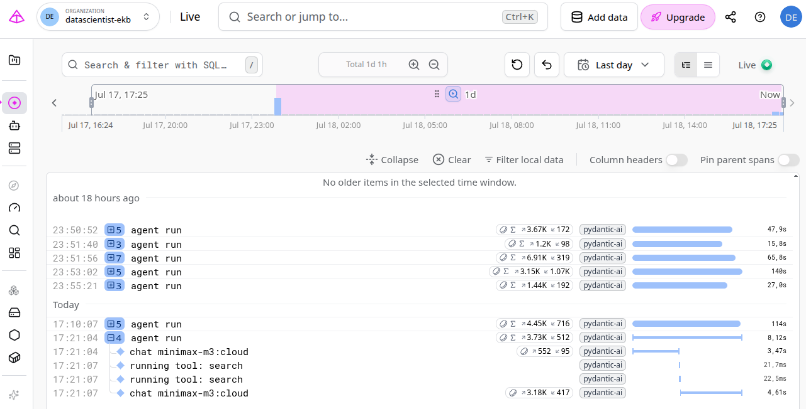

# dlt Workshop Homework — LLM Zoomcamp 2026

Homework for the [dlt Workshop](https://github.com/DataTalksClub/llm-zoomcamp/blob/main/cohorts/2026/workshops/dlt/homework.md).

The task: take the FAQ agent from Module 1, instrument it with Pydantic Logfire for observability, pull the trace data with dlt into DuckDB, and analyze it.

## Stack

- **Agent**: Pydantic AI with local Ollama (`granite4.1:8b`)
- **Observability**: Pydantic Logfire
- **Data pipeline**: dlt + DuckDB

## Project structure

| File | Purpose |
|---|---|
| `agent.py` | FAQ agent definition, supports OpenRouter and Ollama |
| `ingest.py` | Downloads FAQ data and builds minsearch index |
| `main.py` | General-purpose runner for multiple questions |
| `q1_logfire.py` | Runs the agent with Logfire instrumentation (Question 1) |
| `q2_logfire_to_duckdb.py` | dlt pipeline: pulls `records` from the Logfire Query API into DuckDB (Question 2) |

## Setup

```bash
uv init
uv add openai minsearch requests python-dotenv pydantic-ai logfire
uv add "dlt[duckdb]"
```

Add to `.env` (make sure `.env` is in `.gitignore`):

```
OPENAI_API_KEY=sk-YOUR_KEY_HERE
LOGFIRE_TOKEN=<your write token>
LOGFIRE_READ_TOKEN=<your read token>
```

This project uses local Ollama instead of OpenAI. Additional `.env` keys required:

```
OPENAI_BASE_URL=http://localhost:11434/v1
OPENAI_API_KEY=ollama
OLLAMA_BASE_URL=http://localhost:11434
```

---

## Answers

### Question 1 — Spans per agent run

> For the query "How do I run Ollama locally?", how many spans does a single agent run produce?

Script: [q1_logfire.py](q1_logfire.py)

```bash
uv run python q1_logfire.py
```

**Answer: 5**


---

### Question 2 — Tables in DuckDB

> How many tables did dlt create in the `agent_traces` schema?

Pull Logfire traces into DuckDB using dlt — via the [Logfire Query API](https://pydantic.dev/docs/logfire/manage/query-api/) (`POST /v2/query` on `records`). dlt automatically normalizes the nested JSON spans (attributes, messages, tool calls, etc.) into a set of tables.

Script: [q2_logfire_to_duckdb.py](q2_logfire_to_duckdb.py)

```bash
uv run python q2_logfire_to_duckdb.py
```

```sql
SELECT COUNT(*) FROM information_schema.tables WHERE table_schema = 'agent_traces';
```
Done. Pipeline pulled Logfire records (spans/traces) via Query API into DuckDB schema agent_traces, 23 tables created. 
(includes 3 dlt-internal tables: `_dlt_loads`, `_dlt_pipeline_state`, `_dlt_version`)  

**Answer: 24** 

---

### Question 3 — Input token usage

> Sum `gen_ai.usage.input_tokens` across all LLM calls within the trace from Q1 (last run). Which range does it fall into?
> 100-500 / 1500-5000 / 10000-20000 / 50000-100000

Script: [q3_input_tokens.py](q3_input_tokens.py)

```bash
uv run python q3_input_tokens.py
```

```sql
SELECT SUM(attributes__gen_ai_usage_input_tokens)
FROM agent_traces.records
WHERE trace_id = (
    SELECT trace_id FROM agent_traces.records GROUP BY trace_id ORDER BY MAX(start_timestamp) DESC LIMIT 1
);
```

**Answer: 3735 total input tokens → falls in the 1500 - 5000 range** (2 LLM calls in the trace)
